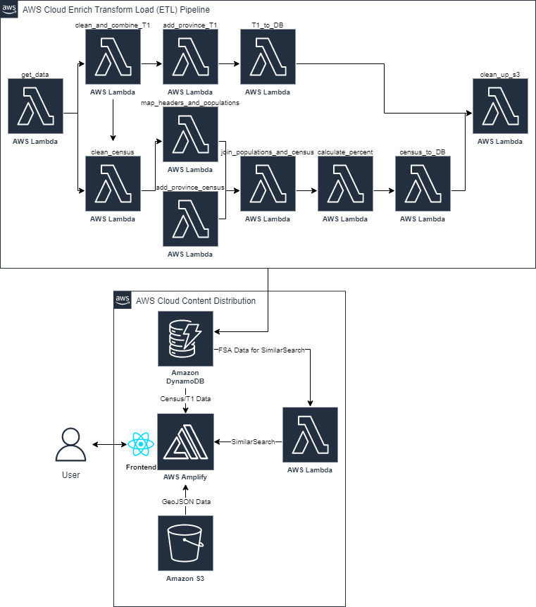

# Census Explorer (Backend)
## Project Overview
This solution will help nonprofits use publicly available information, more specifically the 2016 Census Canada and 2016 T1 datasets. Through a user-friendly platform, Imagine Canada aims to make data more accessible and easy to use. This free digital service will allow users to consume, interpret and analyze data based on parameters that are relevant to them such as: age, income and geography. This solution acknowledges that in many cases nonprofits and charities do not have the necessary tools or expertise to interpret raw data, therefore the solution will be intuitive enough for users to interact with, even if they don’t have data science skills. With this information organizations will be able to improve their decision making process regarding programming and services in areas such as fundraising, recruiting staff and allocation of resources.

## Table of Contents
|Index| Description|
|:----------------|:-----------|
| [Demo](#app-demo)         |    Explore data with Imagine Canada.    | 
| [Stack Overview](#stack-overview)         | See the main parts of the stack: frontend, backend and data.      | 
| [High Level Architecture](#high-level-architecture) | Needs description    |
| [Deployment Guide](#deployment-guide) | A link to the Deployment Guide. |
| [User Guide](#user-guide) |   A link to the User Guide. |
| [Changelog](#changelog)      |     History of what has changed.     |
| [License](#license)      |     License details.     |

## App Demo
Add link

## Stack Overview
* **Frontend**: The ReactJS framework was used to develop the frontend of the application.  AWS Amplify was used to interface with other Amazon Web Services such as: S3, Lambda and DynamoDB. The library used to display the map is react-leaflet / leaflet.js, which has a GeoJSON layer attached. All other components were developed in React from scratch. 

* **Data Preparation**: All data was initially processed using a step function running a sequence of lambdas.

* **Data Storage**: All data is saved in Amazon S3 and DynamoDB. Namely, GeoJSON files are stored in S3, and Census/T1 data is stored in DynamoDB. 

* **Data Processing**: The backend has  lambda functions to process incoming data from DynamoDB, fetched through a GraphQL API.

## High Level Architecture

## Deployment Guide
To deploy this solution into your AWS account, please follow the [Deployment Guide](https://github.com/UBC-CIC/census-explorer-backend/docs/DeploymentGuide.md).

## User Guide
Link to frontend repo???

## Changelog
* [DATE]: Initial release.

## License
This project is distributed under the [MIT??? License]().