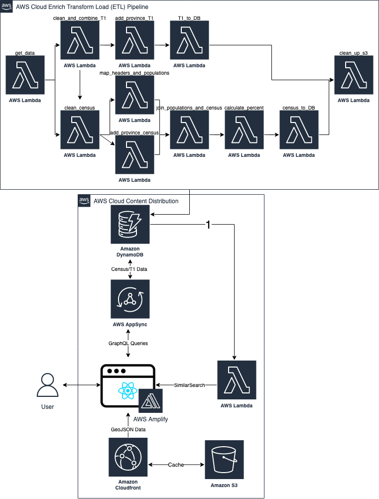

# Census Explorer

## Project Overview

This prototype draws from publicly available information, more specifically the 2016 Census Canada and 2018 T1 datasets, and makes them accessible through a user-friendly interactive map. This application allows users to consume, interpret and analyze data based on parameters that are relevant to them such as: age, income and geography. This solution acknowledges that in many cases nonprofits and charities do not have the necessary tools or expertise to interpret raw data, so it aims to make the data comprehensible for users without a data science background. With this information organizations will be able to improve their decision making process regarding programming and services in areas such as fundraising, recruiting staff and allocation of resources.

The backend uses [AWS Lambda](https://aws.amazon.com/lambda/) functions to get data from the multiple data
sources, and persist them into:

- [Amazon DynamoDB](https://aws.amazon.com/dynamodb/) - for viewing content based on parameterized searches

## Table of Contents

| Index                                               | Description                                    |
| :-------------------------------------------------- | :--------------------------------------------- |
| [High Level Architecture](#high-level-architecture) | Examine the application architecture.          |
| [Application Screenshots](#application-screenshots) | Check out the application's user interface.    |
| [Stack Details](#stack-details)                     | Learn more about each stack of the application |
| [Deployment](#deployment)                           | Learn how to deploy this project yourself.     |
| [User Guide](#user-guide)                           | Learn how to use the heatmap interface.        |
| [Credits](#credits)                                 | Meet the team behind this                      |
| [License](#license)                                 | License details.                               |

## High Level Architecture

<h6 align="center">Architecture Diagram</h6>

## Application Screenshots

<h6 align="center">Interactive User Interface</h6>

## Stack Details

- [Frontend User Interface](./docs/FrontendArchitecture.md)
- [Backend ETL](https://github.com/UBC-CIC/census-explorer-backend)

## Deployment

To deploy the Frontend of this solution into your AWS Account press the following button.

The backend must be deployed after the frontend has been deployed.
Please follow the deployment steps in the [Backend Repo](https://github.com/UBC-CIC/census-explorer-backend).

## User Guide

Please see our user guide [here](./docs/UserGuide.md)

## Credits

This application was architected and developed by Trevor Flanigan and Alyssa da Costa, with guidance from the [UBC CIC](https://cic.ubc.ca/)
technical and project management teams.

## License

This project is distributed under the [MIT License](./LICENSE).
