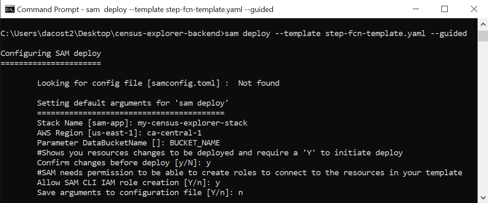

# Requirements
For deployment:
* [AWS Account](https://aws.amazon.com/account/)
* [GitHub Account](https://github.com/)
* [SAM CLI](https://docs.aws.amazon.com/serverless-application-model/latest/developerguide/serverless-sam-cli-install.html) (**Note:** *Step 3: Install Docker* is not required)

For prototyping:
* [Python 3.7 or greater](https://realpython.com/installing-python/) 

# Step 0: Request T1 data from Statistics Canada
1. Email "emailaddress" and request ... # TODO
2. Once you have the two files, rename them to "donations_by_family_type.csv"and "donations_by_income_group.csv".

# Step 1: Front-end Deployment
See the [front-end deployment guide](https://github.com/UBC-CIC/census-explorer-frontend#deployment).

# Step 2: Back-end/Data Preparation Deployment
## Step 2.1: Clone this repository
## Step 2.2: Create an S3 bucket for data
1. Log into the S3 management console.
2. Click on the **Create Bucket** button.  Give the bucket a unique name, and select your region.  Make sure you save the bucket name and remember which region you selected, as you will need both later.  Accept the rest of the default settings and select **Create bucket**.

## Step 2.3: Upload files for data preparation
1. Log in to the S3 management console.
2. Select the bucket you created in step 2.2.  Click **Create folder**, and name it "unprocessed-data".
3. Select the new *unprocessed-data* folder.  Click **Upload**, and add the "headers.csv" file from the data directory in this repository and the two files obtained from Statistics Canada in step 0 ("donations_by_family_type.csv" and "donations_by_income_group.csv").

## Step 2.4: Deploy CloudFormation template
1. In a terminal in the project root directory, enter the following command.  This will guide you through the deployment process.  The CloudFormation template will create a Step Function and the Lambda functions it triggers to fetch and prepare the census and T1 data.
    
    Parameter details:
    * Stack Name: An identifier for your stack.
    * AWS Region: The region where the solution will be deployed.  Ensure this is the same region you created your bucket in.
    * DataBucketName: The name of the bucket you created in Step 2.2.

```bash
sam deploy --template step-fcn-template.yaml --guided
```


**Note:** Make sure this step completes successfully before moving on to the next step.

## Step 2.5: Trigger data preparation Step Function
1. Log in to the Lambda management console.  Select **Step functions state machines** from the menu on the left.
2. Select the state machine - the name should start with "DataProcessingStateMachine-".
3. Click **Execute**.  Leave all settings at default.

Once the state machine finishes executing successfully, backend deployment and data preparation is complete!