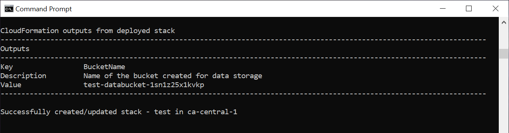
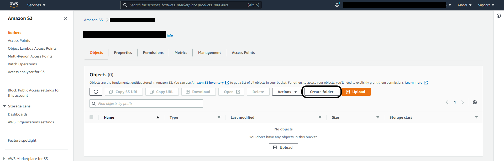
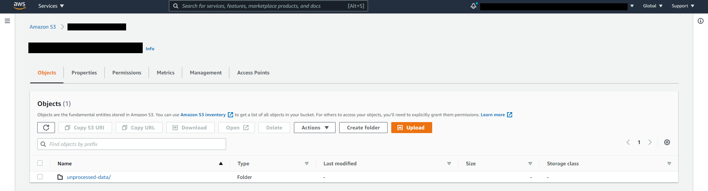
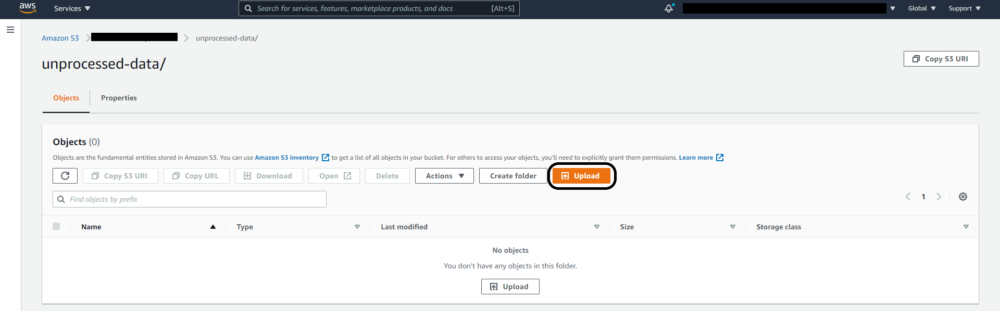
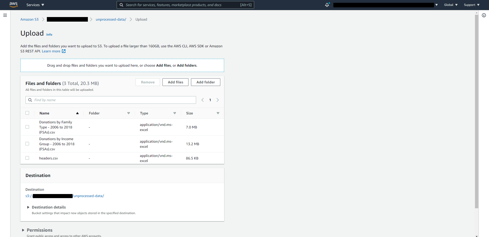
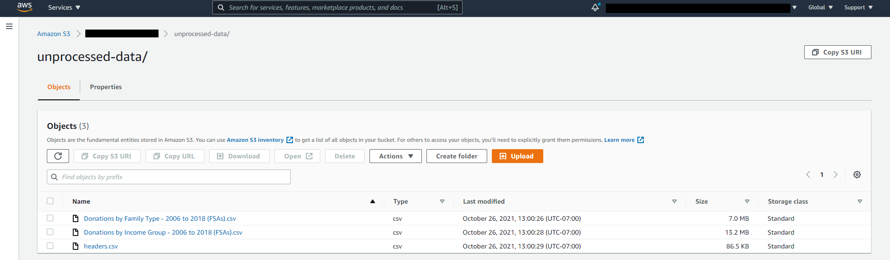

# Requirements
For deployment:
* [AWS Account](https://aws.amazon.com/account/)
* [GitHub Account](https://github.com/)
* [SAM CLI](https://docs.aws.amazon.com/serverless-application-model/latest/developerguide/serverless-sam-cli-install.html) (**Note:** *Step 3: Install Docker* is not required)

For prototyping:
* [Python 3.7 or greater](https://realpython.com/installing-python/) 

# Step 0: Request T1 data from Statistics Canada
1. Email "emailaddress" and request ... # TODO

# Step 1: Front-end Deployment
To deploy the Frontend of this solution into your AWS Account, press the following button:

[](https://console.aws.amazon.com/amplify/home#/deploy?repo=https://github.com/UBC-CIC/census-explorer-frontend)

# Step 2: Back-end/Data Preparation Deployment
## Step 2.1: Clone this repository

## Step 2.2: Deploy CloudFormation template
1. In a terminal in the project root directory, enter the following command.  This will guide you through the deployment process.  The CloudFormation template will create a Step Function and the Lambda functions it triggers to fetch and prepare the census and T1 data.
    
    Parameter details:
    * Stack Name: An identifier for your stack.
    * AWS Region: The region where the solution will be deployed.

```bash
sam deploy --template step-fcn-template.yaml --guided
```


**Note:** Make sure this step completes successfully before moving on to the next step.

2. When the deployment is complete, a parameter with the key *BucketName* will be output.  This is the bucket you will be uploading data to in the future, so remember the name.



## Step 2.3: Upload files for data preparation
1. Log in to the S3 management console.
2. Select the bucket created by the CloudFormation template in step 2.2.  Click **Create folder**, and name it "unprocessed-data".





3. Select the new *unprocessed-data* folder.  Click **Upload**, and add the "headers.csv" file from the data directory in this repository and the two files obtained from Statistics Canada in step 0 (the names of these files don't matter).







## Step 2.4: Trigger data preparation Step Function
1. Log in to the Lambda management console.  Select **Step Functions state machines** from the menu on the left.
2. Select the state machine - the name should start with "DataProcessingStateMachine-".
3. Click **Execute**.  Leave all settings at default.

Once the state machine finishes executing successfully, backend deployment and data preparation is complete!