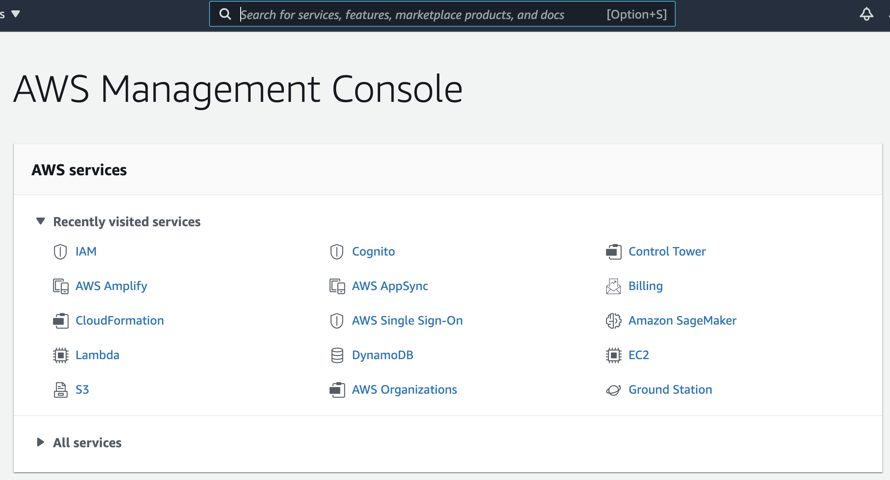
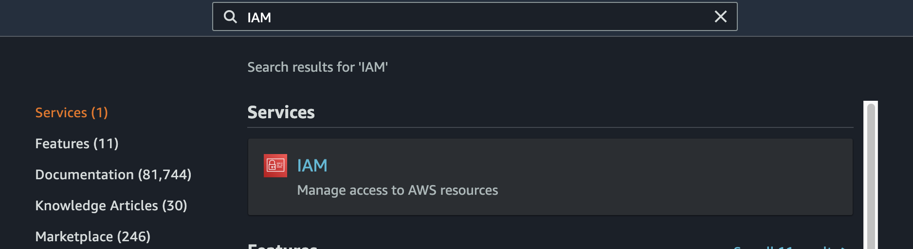
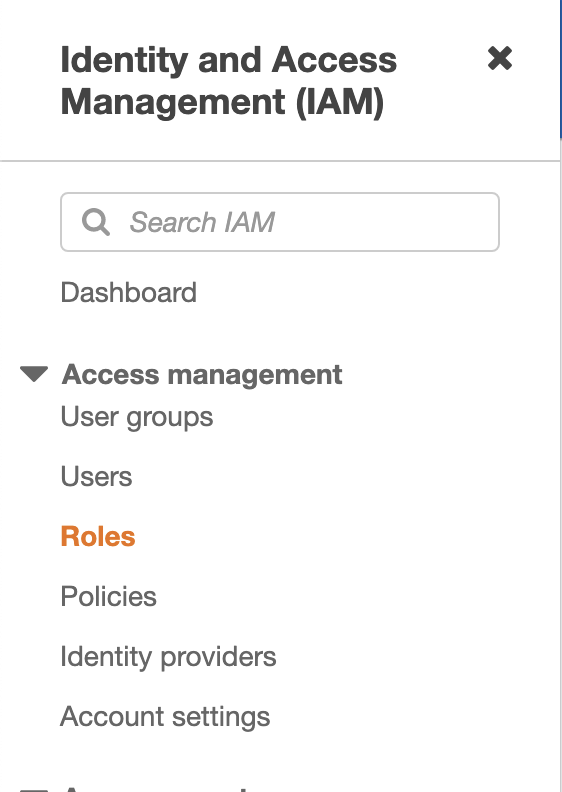
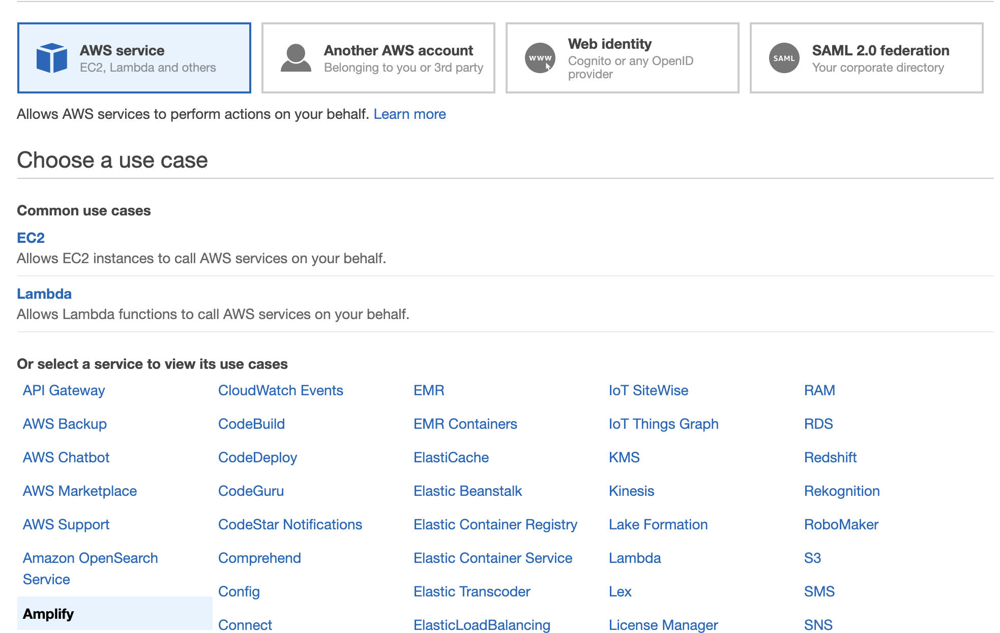
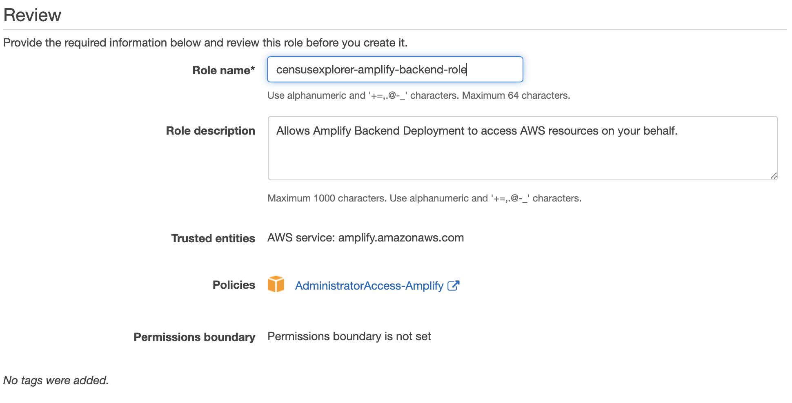
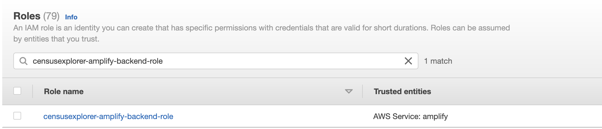
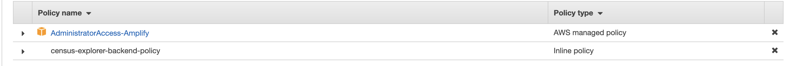
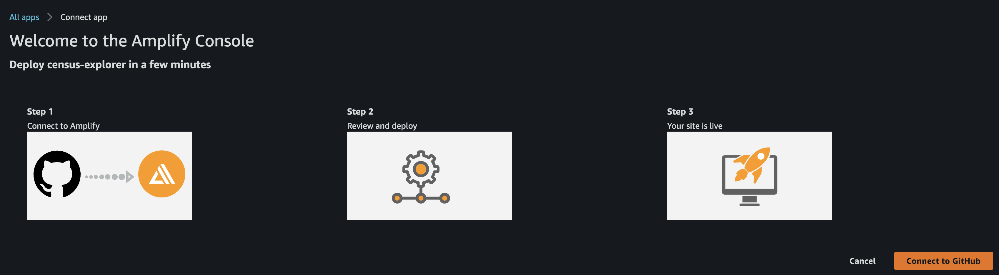
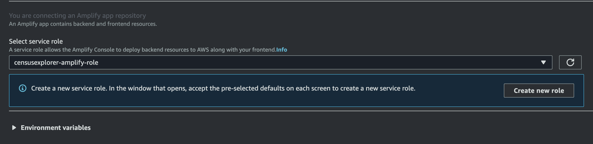

# Requirements

For deployment:

- [AWS Account](https://aws.amazon.com/account/)
- [GitHub Account](https://github.com/)
- [SAM CLI](https://docs.aws.amazon.com/serverless-application-model/latest/developerguide/serverless-sam-cli-install.html) (**Note:** _Step 3: Install Docker_ is not required)

For prototyping:

- [Python 3.7 or greater](https://realpython.com/installing-python/)

# Step 0: Request T1 data from Statistics Canada

1. Email "emailaddress" and request ... # TODO

# Step 1: Frontend Deployment

## Create a Service Role

Please create a new service role in your AWS Account.

1. Log into the AWS Console on your AWS Account with IAM Permissions.
   
2. Search for IAM and click on the first suggestion.
   
3. Click on Roles in the left sidebar.
   
4. Click on Create Role
5. Scroll down and click on Amplify
   
6. Click next until you get to the Review page.
   Name the role: This example uses 'censusexplorer-amplify-backend-role'
   
7. Click Create Role.
8. Find your new role by searching for it in the roles search bar. Click on it.
   
9. Click on Add inline policy
10. Click on the JSON tab, and replace the text box with the contents of [this file](./servicePolicy.json).
11. Click on Review Policy, and name it appropriately. Eg: 'census-explorer-backend-policy'
12. Click on Create Policy. You should see something similar to this:
    

## Deploy the Frontend

To deploy the frontend of this solution into your AWS Account, press the following button:

[](https://console.aws.amazon.com/amplify/home#/deploy?repo=https://github.com/UBC-CIC/census-explorer)

This should take you to the following screen: Click on Connect to Github and log in to your Girhub Account.


**From the dropdown, make sure to choose the role that you just made!**


Click on save and deploy.

# Step 2: Backend/Data Preparation Deployment

## Step 2.1: Clone this repository

## Step 2.2: Deploy CloudFormation template

1. In a terminal in the project root directory, enter the following command. This will guide you through the deployment process. The CloudFormation template will create a Step Function and the Lambda functions it triggers to fetch and prepare the census and T1 data.

   Parameter details:

   - Stack Name: An identifier for your stack.
   - AWS Region: The region where the solution will be deployed.

```bash
sam deploy --template step-fcn-template.yaml --guided
```


**Note:** Make sure this step completes successfully before moving on to the next step.

2. When the deployment is complete, a parameter with the key _BucketName_ will be output. This is the bucket you will be uploading data to in the future, so remember the name.


## Step 2.3: Upload files for data preparation

1. Log in to the S3 management console.
2. Select the bucket created by the CloudFormation template in step 2.2. Click **Create folder**, and name it "unprocessed-data".


3. Select the new _unprocessed-data_ folder. Click **Upload**, and add the "headers.csv" file from the data directory in this repository and the two files obtained from Statistics Canada in step 0 (the names of these files don't matter).


**Note:** Make sure the files finish uploading before moving on to the next step.

## Step 2.4: Trigger data preparation Step Function

1. Log in to the Lambda management console. Select **Step Functions state machines** from the menu on the left.
2. Select the state machine - the name should start with "DataProcessingStateMachine-".
3. Click **Execute**. Leave all settings at default.

Once the state machine finishes executing successfully, backend deployment and data preparation is complete!
