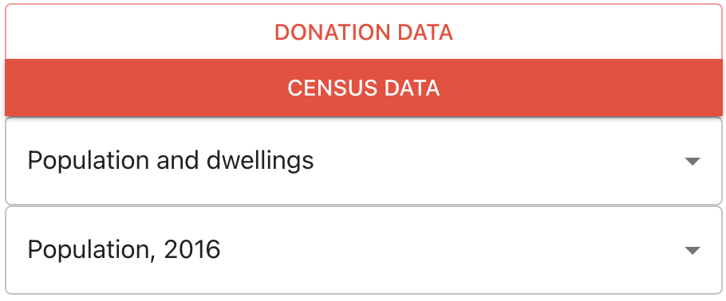
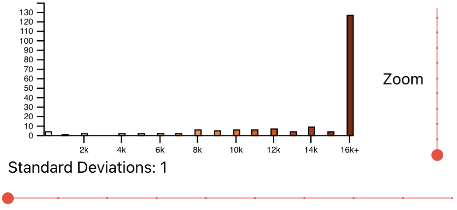
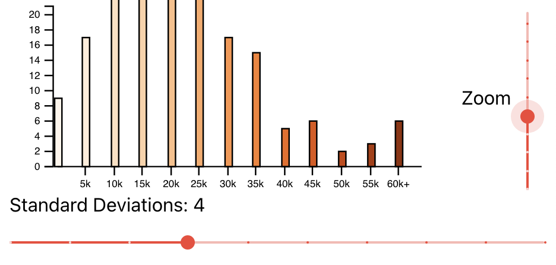
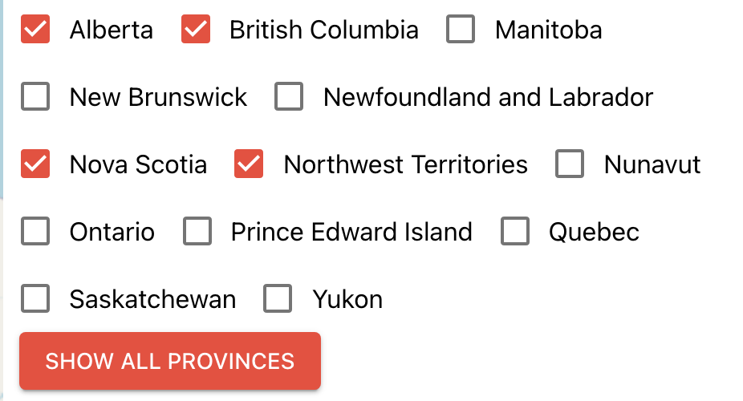
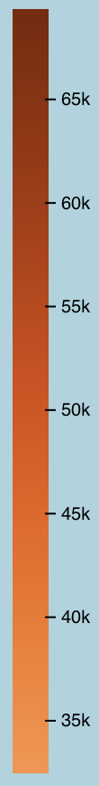
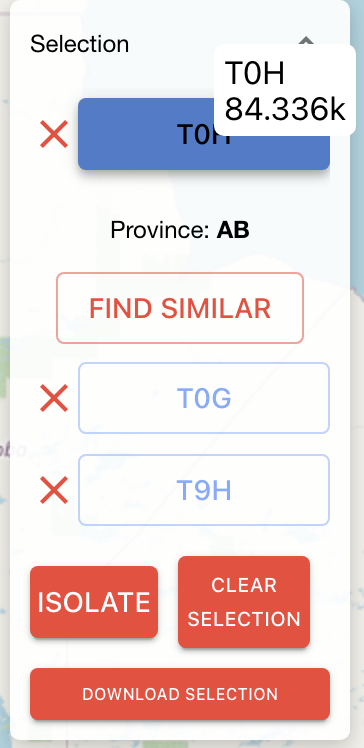
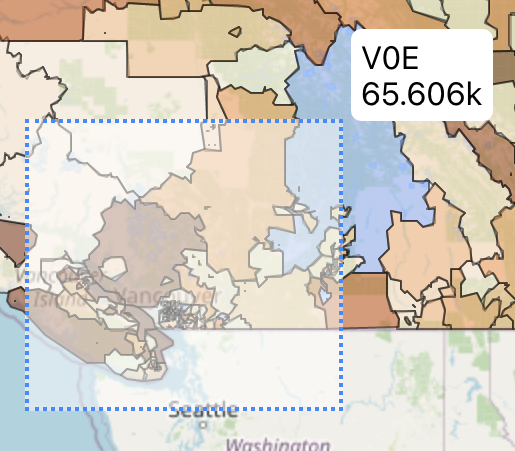
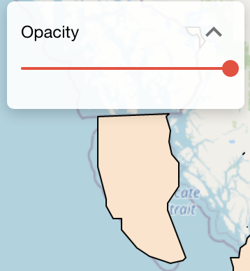
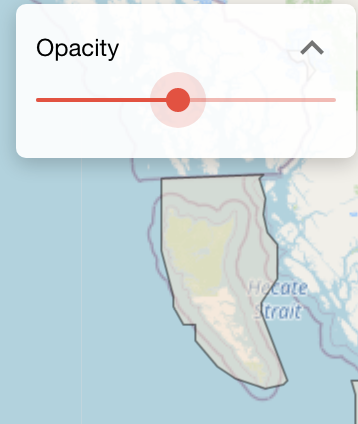

# User Guide

This user guide contains a brief tutorial to get you started using the provided Census Explorer frontend dashboard.

## Table of Contents

| Index                           | Description                                             |
| :------------------------------ | :------------------------------------------------------ |
| [UI Overview](#ui-overview)     | High level overview of User Interface with Screenshots. |
| [Sidebar](#sidebar)             | Details about using the sidebar                         |
| [Stack Details](#stack-details) | Learn more about each stack of the application          |
| [Deployment](#deployment)       | Learn how to deploy this project yourself.              |
| [User Guide](#user-guide)       | Learn how to use the heatmap interface.                 |
| [Credits](#credits)             | Meet the team behind this                               |
| [License](#license)             | License details.                                        |

## UI Overview

Once the user has logged in, the system will load the map data and you will be greeted with the **Heatmap** and **Sidebar**. After some loading period, you will be shown the heatmap of one set of parameters, namely, **Donation Data** sorted by **Family Data**, showing the **Donation Total** data of **Couples with Children**.

## Sidebar

The sidebar contains:

- Parameter buttons that users can use to choose which variables to visualize.
- A Histogram that shows the number of FSAs that fall into a given numerical range
- A province selector to choose which provinces they would like to analyze.

### Parameters

Parameters can be changed by clicking the corresponding buttons in the Sidebar. For example, to see **Donation Data** sorted by **Income**, press the **Income Data** button, and the heatmap will load the new dataset.

To view **Census Data**, you will be able to view the **Category Headers** via the dropdown. Choose the **Subheader** which you would like to examine:

### Histogram

In the **Sidebar**, you will see a **Histogram**. This histogram shows the number of **FSAs** that fall into each numerical bin.

To get a finer grain view of the data, use the **Standard Deviations Slider** to change the scale of the X-Axis, and the **Zoom Slider** to change the scale of the Y-axis.

Hovering over a bar in the Histogram will show the exact number of FSAs that fall into that bin. Clicking the bar will select all the FSAs that fall into that range.

### Province Selection

In the **Sidebar**, you can choose which provinces you would like to view.

## Heatmap

|                                         |                                                                                                                                                                                                                                                                                                                                                                                                |
| :-------------------------------------- | :--------------------------------------------------------------------------------------------------------------------------------------------------------------------------------------------------------------------------------------------------------------------------------------------------------------------------------------------------------------------------------------------- |
|  | The heatmap is where the selected parameter is visualized.  All the FSAs in Canada will be shown, colored corresponding to the value of the selected parameter.  Users can zoom and pan around the map, selecting FSAs for further analysis. The Heatmap contains a ColorScale Bar, which shows the number that a hue represents. Hovering over an FSA shows where on the scale it lies. |

### FSA Selection

You can click on individual FSAs to inspect them, download them, and Find Similar, which finds FSAs that have similar T1 Donation Data, or Census Data, depending on your parameter selection.
Clicking on Isolate makes the heatmap only show your selected FSAs. Clear Selection unselected all FSAs, and when your selection is clear, you can Reset, to un-Isolate your FSAs.

To select multiple FSAs at once, hold CTRL, and drag your mouse to select a square.

### Map Opacity

The Opacity Slider changes the opacity of the heatmap, from transparent to opaque.

